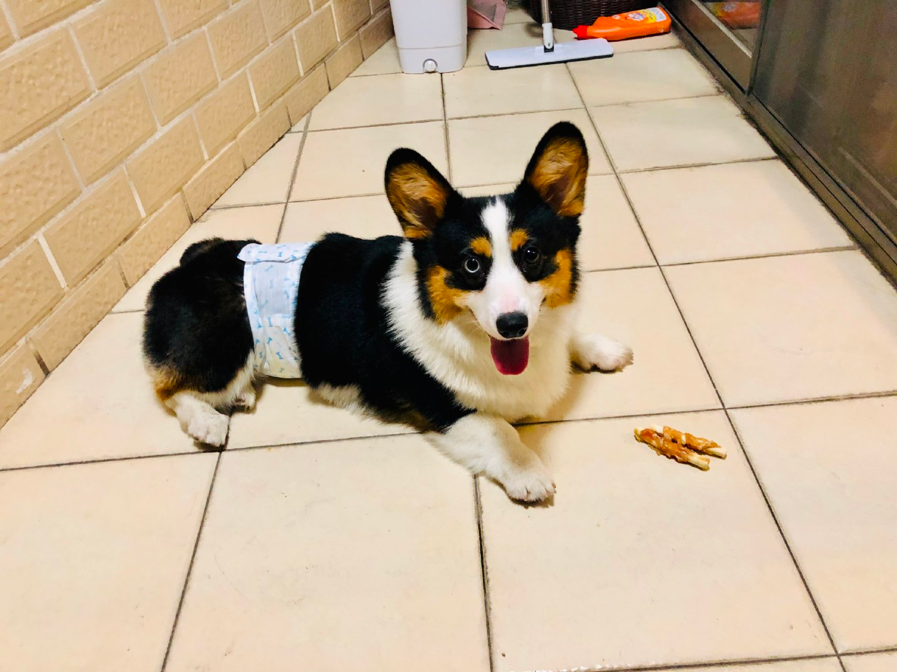

## 👋 Introduction

<!--
**erkang/erkang** is a ✨ _special_ ✨ repository because its `README.md` (this file) appears on your GitHub profile.
-->
### Hi there 👋

I'm `erkang`,  [bolg](https://qekang.com) 他是一名计算机软件行业的博主,他一直在热衷于分享后台技术栈,服务器领域的技术知识。他主要关注安全架构方面的内容。

除了编码之外，我还我喜欢：音乐、电影、专研技术、搭建&研究开源服务。我还养了一只小柯基🐶他叫克林顿。我目前生活在南京，我喜欢这座城市，这是我所偏爱的所谓文青慢活的生活节奏，这里有南京六朝古都，历史与现代交织，人文与自然融合，让人流连忘返。


 **我空余时间都花在:**

<!--START_SECTION:waka-->

```txt
From: 2024

Average Daily Time: 7 hrs 18 mins

Java              5 hrs 18 mins  ████████████████████▒░░░░   78.60 %
Linux             1 hrs 15 mins  ███████████▒░░░░░░░░░░░░░   15.85 %
Markdown          20 mins        ████▓░░░░░░░░░░░░░░░░░░░░   03.15 %
YAML              15 mins        ███▓░░░░░░░░░░░░░░░░░░░░░   02.20 %
HTML              10 mins        ██▓░░░░░░░░░░░░░░░░░░░░░░   01.20 %
```


### 🌐 Find Me


<p>
  <a href="https://qekang.com" target="_blank"></a>
  <a href="https://blog.csdn.net/qierkang" target="_blank"></a>
  <a href="https://gitee.com/qierkang" target="_blank"></a>
  <a href="mailto:xyqierkang@163.com" target="_blank"></a>
  
</p>

-----
<table>
  <tbody>
  <tr>
    <td><a href="./assets/shutiao.png" target="_blank"></a>
    </td>
  </tr>
  <tr>
    <td>
      <a href="https://jrebel.qekang.com" target="_blank"></a>
     <a href="https://jrebel.qekang.com" target="_blank"></a>
    </td>
  </tr>
  </tbody>
</table>
